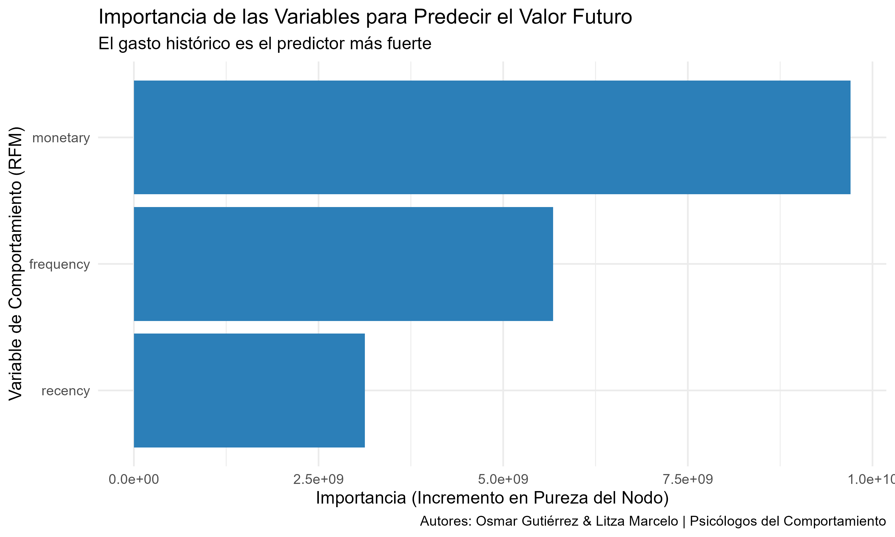

# Modelo Predictivo de Valor de Vida del Cliente (CLV)

Un proyecto de Gutierrez Fernandez, Jesus Osmar y Marcelo Porcayo, Tonancy Lizahaya \| Especialistas del Comportamiento

## 1. Contexto del Problema de Negocio

Una empresa líder de E-commerce con un presupuesto de marketing de \$10M USD buscaba optimizar su inversión. El objetivo de este análisis fue desarrollar un modelo de Machine Learning para predecir el valor futuro de sus clientes, permitiendo así una asignación de recursos más rentable y estratégica.

## 2. Pregunta de Análisis

> ¿Podemos predecir de manera fiable el gasto total de un cliente en los próximos 90 días, basándonos en su comportamiento de compra histórico (Recencia, Frecuencia y Gasto Monetario)?

## 3. Metodología y Datos

Se utilizó un modelo de **Regresión con Random Forest** para predecir el valor numérico del gasto futuro. El modelo fue entrenado con un historial de transacciones, a partir del cual se construyeron características de comportamiento (métricas RFM). La validación en datos de prueba demostró una fuerte capacidad predictiva, con un **R-cuadrado del 65%**.

## 4. Hallazgo Clave: El ADN del Valor Futuro

El modelo reveló que el comportamiento pasado es un excelente predictor del futuro. El factor más influyente es el **gasto histórico (`monetary`)**, seguido por la **frecuencia de compra (`frequency`)**. Esto confirma que la mejor señal de un futuro cliente valioso es su historial de compromiso y gasto con la marca.

## 5. Conclusión y Estrategia Propuesta (ROI)

El modelo no es una bola de cristal, es un **sistema de priorización inteligente**. Permite a la empresa pasar de un marketing masivo a una estrategia focalizada de 3 niveles: 1. **Programa VIP:** Blindar al top 10% de clientes con mayor valor predicho. 2. **Campaña de "Segunda Compra":** Reactivar a la masiva base de compradores ocasionales. 3. **Servicio al Cliente Predictivo:** Dar atención prioritaria a clientes con alto potencial.

Este enfoque permite una inversión quirúrgica y rentable, asegurando que los recursos se dirijan a los clientes que construirán el futuro de la empresa.

## 6. Ver el Reporte Completo

**[Visualizar el Reporte Completo aquí](https://psicosmarg.github.io/PREDICCION-VALOR-DE-VIDA-DEL-CLIENTE-2025/)**