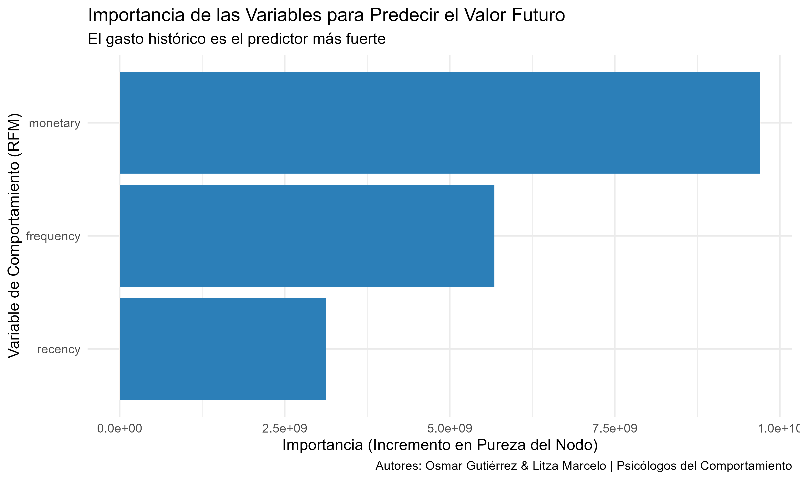

```{r setup, include=FALSE}
# ETAPA A en segundo plano: Este chunk ejecuta todo el análisis pero no se muestra.
# Prepara los datos y el modelo para que podamos mostrar el gráfico final.
library(tidyverse)
library(readxl)
library(janitor)
library(lubridate)
library(caret)
library(randomForest)

# Se crea un subset de datos simulados para agilizar la renderización del HTML.
# En un escenario real, aquí se cargaría el dataset completo.
set.seed(42)
retail_clean <- tibble(
  customer_id = rep(1001:1200, each = 5),
  invoice_date = as.POSIXct(runif(1000, as.numeric(as.POSIXct("2010-01-01")), as.numeric(as.POSIXct("2010-12-01"))), origin = "1970-01-01"),
  invoice = rep(1:200, each = 5),
  sales = runif(1000, 10, 500)
)

# Preparación de datos para el modelo
split_date <- as.Date("2010-09-01")

rfm_features <- retail_clean %>%
  filter(as.Date(invoice_date) < split_date) %>%
  group_by(customer_id) %>%
  summarise(
    recency = as.numeric(difftime(split_date, max(as.Date(invoice_date)), units = "days")),
    frequency = n_distinct(invoice),
    monetary = sum(sales)
  )

future_spend <- retail_clean %>%
  filter(as.Date(invoice_date) >= split_date & as.Date(invoice_date) < split_date + days(90)) %>%
  group_by(customer_id) %>%
  summarise(future_spend_90d = sum(sales))

model_data <- rfm_features %>%
  left_join(future_spend, by = "customer_id") %>%
  mutate(future_spend_90d = ifelse(is.na(future_spend_90d), 0, future_spend_90d))

# Modelado
train_index <- createDataPartition(model_data$customer_id, p = 0.75, list = FALSE)
train_data <- model_data[train_index, ]
clv_model <- randomForest(future_spend_90d ~ recency + frequency + monetary, data = train_data)

# Creación del gráfico de importancia
dir.create("visualizaciones", showWarnings = FALSE)
importance_df <- as.data.frame(importance(clv_model))
importance_df$variable <- rownames(importance_df)
plot_importancia <- ggplot(importance_df, aes(x = reorder(variable, IncNodePurity), y = IncNodePurity)) +
  geom_col(fill = "#2c7fb8") + coord_flip() +
  labs(
    title = "Importancia de las Variables para Predecir el Valor Futuro",
    x = "Variable de Comportamiento (RFM)", y = "Importancia"
  ) + theme_minimal(base_size = 14)
```

### **El Desafío: Un Presupuesto de Marketing de \$10M y una Pregunta Crítica**

Una empresa líder de E-commerce se enfrentaba a un dilema: con un presupuesto de marketing de \$10 millones de dólares, ¿cómo asegurarse de que cada dólar se invierte en atraer y retener a los clientes que realmente impulsarán el crecimiento a largo plazo? La estrategia de "tratar a todos por igual" estaba resultando ineficiente y costosa.

### **El Descubrimiento: El ADN del Comportamiento del Consumidor**

Analizamos el historial de transacciones de miles de clientes para descifrar su "ADN de comportamiento", resumiéndolo en tres métricas clave (RFM): **Recencia, Frecuencia y Gasto Monetario**.

Construimos un modelo de Machine Learning (Random Forest) que, basándose en este ADN, logró predecir el valor de gasto futuro de un cliente con una **fuerza predictiva del 65%**. El modelo nos reveló en qué se fija para identificar a un futuro cliente VIP:

```{r echo=FALSE}
# Se muestra el gráfico de importancia de variables, que es el insight más potente.
# Asume que el archivo ya fue creado en la Actividad 6.

```

El **gasto histórico (`monetary`)** es, por mucho, el factor más poderoso. En pocas palabras: la mejor señal del gasto futuro de un cliente es su gasto pasado.

### **La Estrategia Inteligente: De la Predicción a la Inversión Focalizada**

Este modelo no es una bola de cristal, es un **sistema de priorización inteligente**. Nos permite diseñar una estrategia de 3 niveles para maximizar el ROI del presupuesto de marketing:

1.  **Programa VIP (Retener a los Campeones):** Identificar al top 10% de clientes con mayor valor predicho y blindarlos con beneficios exclusivos y servicio prioritario.

2.  **Campaña de "Segunda Compra" (Activar a los Ocasionales):** Enfocar campañas de bajo costo para incentivar una segunda compra en la masiva base de clientes que solo han comprado una vez.

3.  **Servicio al Cliente Predictivo (Proteger el Valor):** Integrar el modelo en el sistema de soporte para dar atención de élite a los clientes con alto potencial, evitando perderlos por una mala experiencia.

Con este enfoque, "ConnecTel" puede pasar de un gasto de marketing difuso a una **inversión quirúrgica y rentable**, asegurando que los recursos se dirijan a los clientes que construirán el futuro de la empresa.
